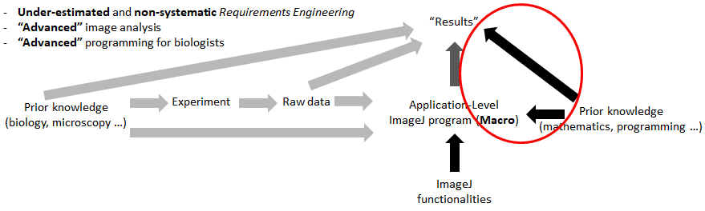
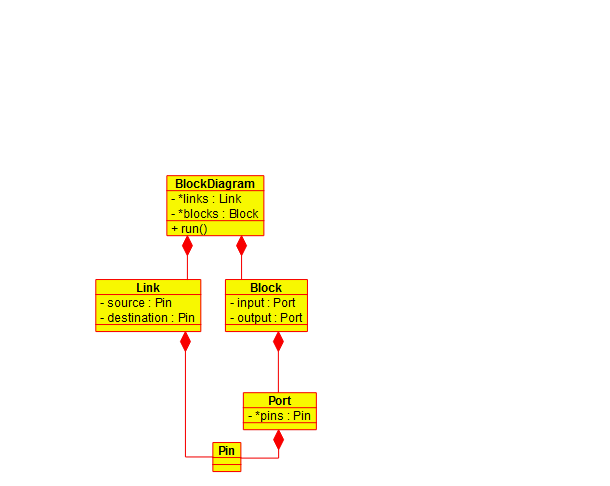

# ImageJ-Workflow
Block-Diagram (XML) model of an application-level ImageJ program and an intrinsic  visual editor for defining, loading, editing, and running such models

<b>Conventional</b> vs. <b>new</b> application-level programming
 

   

<b>Class Diagram</b> of the program
 

